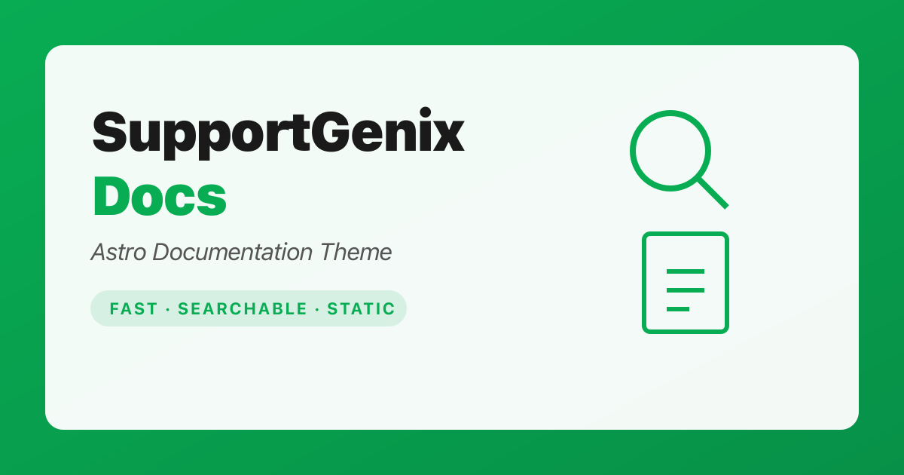

# SupportGenix Docs



A free, production-ready Astro theme for documentation sites, help centers, and knowledge bases. Static, fast, and fully customizable.

[Live Demo](https://astro.supportgenix.com) | [WordPress Version](https://supportgenix.com/)

## Features

- **Astro 6** with static output — deploy anywhere
- **MDX content collections** with schema validation
- **Built-in search** — Pagefind full-text search with automatic JSON fallback
- **SEO-ready** — canonical URLs, Open Graph, Twitter cards, JSON-LD, sitemap
- **Tailwind CSS 4** with design tokens and custom theme
- **Alpine.js** for lightweight interactivity (mobile menu, search, feedback)
- **Category pages**, article pages, related articles, and pagination
- **Article feedback** — "Was this helpful?" UI (localStorage, no backend needed)
- **Config-driven** — update brand, links, and social from a single file
- **Self-hosted fonts** via `@fontsource/poppins`

## Quick Start

**Requirements:** Node.js 22.12+ and npm 9.6+

```bash
npm install
npm run dev
```

Open `http://localhost:4321`.

### Available Scripts

| Command | Description |
|---------|-------------|
| `npm run dev` | Start dev server |
| `npm run build` | Build to `dist/` + generate Pagefind index |
| `npm run preview` | Preview production build |

> Pagefind search only works after a full build. In dev, the fallback JSON search is used automatically.

## Configuration

Update these before deploying:

**`src/lib/site-config.ts`** — Single source of truth for your site:

```ts
export const SITE_CONFIG = {
    brandName: "Your Docs",
    organizationName: "Your Company",
    defaultAuthor: "Documentation Team",
    siteUrl: "https://yourdomain.com",
    links: {
        home: "/",
        docsHome: "/docs",
        blog: "#",        // Replace with your blog URL
        contact: "#",     // Replace with your contact URL
        about: "#",
        terms: "#",
        privacy: "#",
        twitter: "#",
        github: "#",
    },
};
```

**`astro.config.mjs`** — Set `site` to your domain.

**`package.json`** — Set `homepage` and `repository.url`.

**`public/robots.txt`** — Verify the sitemap URL.

## Adding Content

Create MDX files in `src/content/docs/<category>/<article>.mdx`. Categories and navigation are generated automatically from your content.

### Frontmatter

```mdx
---
title: "Getting Started"
description: "Learn how to set up your docs site"
category: "Tutorials"
order: 1
publishedDate: 2026-01-01
lastUpdated: 2026-01-15
tags: ["setup", "quickstart"]
author: "Documentation Team"
tableOfContents: true
---

Your content here.
```

Required fields: `title`, `description`, `category`. All others are optional.

### Images

Place images in `src/assets/images/docs/` and use the `DocImage` component:

```mdx
import DocImage from '../../components/DocImage.astro'

<DocImage src="../../assets/images/docs/screenshot.png" alt="Screenshot" />
```

### URL Structure

File path determines the URL:
- `src/content/docs/tutorials/getting-started.mdx` → `/docs/tutorials/getting-started`

## Project Structure

```text
src/
  content.config.ts          # Content collection schema
  content/docs/**/*.mdx      # Documentation articles
  components/                # UI components
  layouts/
    Layout.astro             # Base layout (Header, Footer, SEO)
    DocsLayout.astro         # Docs layout (sidebar, ToC, feedback)
  lib/
    site-config.ts           # Brand, links, social config
    docs.ts                  # Content query utilities
  pages/
    index.astro              # Homepage
    docs/index.astro         # Docs listing
    docs/[...slug].astro     # Article pages
    docs/category/[category].astro  # Category pages
    search-index.json.ts     # Fallback search endpoint
```

## Deployment

Run `npm run build` and deploy the `dist/` folder to any static host:

- Cloudflare Pages
- Netlify
- Vercel (static output)
- GitHub Pages
- S3 + CDN

## Troubleshooting

**Build fails on Windows with EPERM in `.vite`** — Close the dev server, then run `rmdir /s /q node_modules\.vite` before building again.

**Search not working in dev** — Expected. Pagefind requires a production build. The fallback JSON search still works during development.

**Wrong canonical/sitemap domain** — Check that `site` in `astro.config.mjs` matches your domain.

## WordPress Version

Looking for a WordPress knowledge base? This theme is the static-site companion to [SupportGenix](https://supportgenix.com/) — a WordPress support ticket and knowledge base plugin with built-in ticketing, email piping, AI support, and more.

## License

ISC
